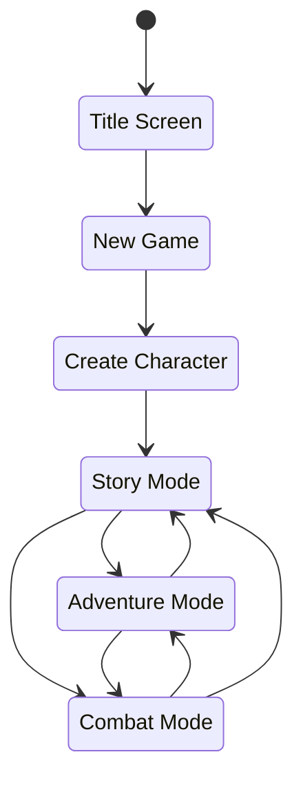

<!--
 Copyright (c) 2020 Trevor Redfern
 
 This software is released under the MIT License.
 https://opensource.org/licenses/MIT
-->

# Design Document

## Game States

## Stories
In most rogue/rpg based games, quests and missions are minimally connected. Frequently they feel like a chore
or they are side-quests which are geared for grinding out XP. Is there a way to change that?

In KoDP stories are interesting because they can lead to more future events. Sometimes it's one-off, sometimes not.

Stories should help build the tension of the experience. Leading towards

