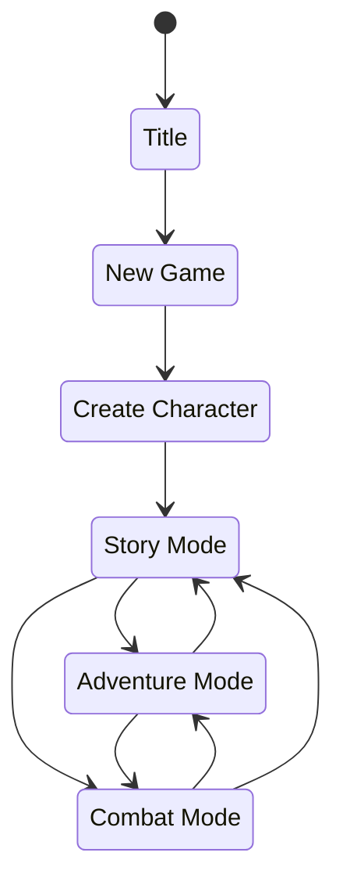
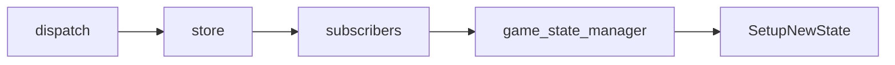

<!--
 Copyright (c) 2020 Trevor Redfern
 
 This software is released under the MIT License.
 https://opensource.org/licenses/MIT
-->

# Design Document

## Overview

You are a character (or group) in a future space-faring universe. 
A sci-fi roguelike adventure game. Quests are story based and should be designed to integrate together. Where characters
in the universe have motivations and endgame events are unfolding.

Similar to systems where there could be several different end-games that are possible. The quests should line up with
this larger endgame. Depending on how the quests, including side-quests are resolved, it will impact how the endgame
plays out.

### Endgame Ideas - STL
1. Beings outside the solar system have discovered and will arrive
1. Interplanetary/system war that is tragic and apocalyptic
1. Comet impacts Earth and eliminating ability to sustain solar system
1. Zombies or other creepy thingy because there is always zombies
1. Supervillian take over the solar-system plot. 

### Endgame Ideas - FTL 
1. Supernova - A star near the region is going to explode. 
1. Precursor wakeup - Advanced beings have been in stasis and are about to wake up
1. Interstellar pandemic - Germ warfare never ended, it just got more advanced
1. Federation/Treaty Collapse into war - A once peaceful galaxy decends into apocalyptic warfare

## High Level Mechanics
### Characters
Attributes
: Strength, Dexterity, Endurance, Intelligence, Knowledge, Personality

Characters have attributes defining key traits and foundations for skills, skills that represent ability to perform tasks
Skill based character development as opposed to class+xp. 
### Adventure Mode

## Technical

### Folder Structure
Assets
: Contains game specific code, fonts, and data

Entities
: Contains the building blocks or pieces for the game. Entities should in general define what they are (properties, 
etc.) and not the behaviors between them.

Rules
: Contains actions, events, reducers and validators that define the behaviors of the game.

### Events / Actions
Events and actions are the main areas that define how the game advances and changes. 

Actions are for changing state. When state changes an event is raised from the store. 

Events represent an occurrence in the system but does not impact state. An event might represent an occurrence in the
game such as transitioning from adventure mode to combat.

### Store / State / Actions / Events

Store
: The store manages the state of the application and is communicated to by dispatch with reducers to change the state

State
: The current immutable state of the application

Action
: Messages that can be dispatched to the store that represent the requested state change

Event
: Represents an occurrence in the system. 

Actions and events are organized under the **rules** folder. Rules represent those pieces that define

## Stories
In most rogue/rpg based games, quests and missions are minimally connected. Frequently they feel like a chore
or they are side-quests which are geared for grinding out XP. Is there a way to change that?

In KoDP stories are interesting because they can lead to more future events. Sometimes it's one-off, sometimes not.

Stories should help build the tension of the experience. Leading towards

## Combat

### Vehicular Combat
#### Ground
+ Terrain and interaction between vehicles is important

#### Air
+ Terrain isn't important anymore, can just focus on the relationship between vehicles

#### Space
+ Ranges become extreme, at long range, simplify the system down but give thoughtful choices to setup situation

### Personal Combat
+ Maps that show the area the battle is happening

## Inspiration

## Interactions
 * Get Contracts
 * Fight something
 * Fulfill contracts to earn rewards
 * Get new contract

## Inspiration
 * Trade Wars
 * Harpoon
 * Traveller
 * Gurps
 * 