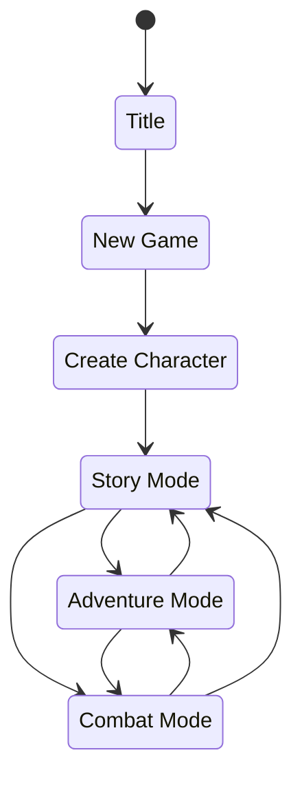

<!--
 Copyright (c) 2020 Trevor Redfern
 
 This software is released under the MIT License.
 https://opensource.org/licenses/MIT
-->

# Design Document

This document will outline design decisions as they progress within developing the game.

## Overview

## High Level Mechanics
### Characters
Attributes
: Strength, Dexterity, Endurance, Intelligence, Knowledge, Personality

Characters have attributes defining key traits and foundations for skills, skills that represent ability to perform tasks

> **TBD**
> Characters sometimes can have skills based progression or experience based... which to do?

### Adventure Mode

## Technical

### Folder Structure
assets
: Contains game specific code, fonts, and data

game
: All the game logic and behaviors.

game/rules
: Each subfolder under the rules directory represents an entity *(such as character)* or some logical grouping of game logic *(like a turn)*
Each rule might contain a reducer to manage state, actions that the reducer processes, entities that can be created. Anything that logically groups that logic and behavior.

game/ui
: All the interface components and screens

### Store / State / Actions / Events

Store
: The store manages the state of the application and is communicated to by dispatch with reducers to change the state

State
: The current state of the application. Not immutable like in classic Redux implementations but at least isolated from contact

Rules
: Define entities, behaviors/actions and state management. Rules should be logicall

Action
: Messages that can be dispatched to the store that represent the requested state change

## Story
In most rogue/rpg based games, quests and missions are minimally connected. Frequently they feel like a chore
or they are side-quests which are geared for grinding out XP. Is there a way to change that?

In KoDP stories are interesting because they can lead to more future events. Sometimes it's one-off, sometimes not.

Another aspect of story that I ruins immersion is that the plot stories wait for my character to show up. I get it, because most stories are intricate and non-resilient to dynamic impacts and that is challenging, but when I read novels it doesn't *feel* like the characters in it are all idle, all sides of the story progress.

But when you play an RPG, like Oblivion where the start of the game town was burning down the entire time. It feels like a game.

## Combat

### Vehicular Combat
#### Ground
+ Terrain and interaction between vehicles is important

#### Air
+ Terrain isn't important anymore, can just focus on the relationship between vehicles

#### Sea

#### Space
+ Ranges become extreme, at long range, simplify the system down but give thoughtful choices to setup situation

### Personal Combat
+ Maps that show the area the battle is happening
+ Can personal combat happen in terrains like water, space, interdimensional portals of death?

## Interactions
 * Get Contracts
 * Fight something
 * Fulfill contracts to earn rewards
 * Get new contract

## Inspiration
 * 