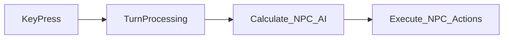

## Session Plan
*Jan 9, 2021*

**Goal**
- ~~Introduce concept of "turns"~~
- ~~When player executes an action, it's also trigger an end of the players turn~~
- ~~Provide a complex action that processes the players action and then executes the turn logic~~
- ~~Introduce concept of AI processing for characters~~
- ~~AI can trigger "moves"~~
- ~~Moves can attack player (or other characters)~~

**Bonus Round**
- Character can enter a name
- Stats UI displaying some basic information

**Refactor Fun**
- Game set up should be in the *rules* folder and a complex action that configures the state

### Notes

### TODO:
- Allow specifying initial state within create_slice