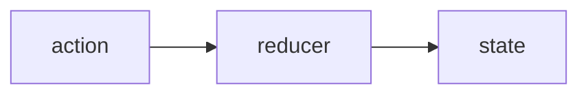

## State Management

State management holds all the values necessary for the game to run/reload etc...
The state is managed by reducers that are configured in specific rules folders

State is changed via actions that are specified by the rules library.

State is also divided into slices for _areas of concern_.

**Setting up state to be efficient and clean as possible is the key to the game operating successfully**

Principles:
- State should be segmented into common areas. Think in terms of relational databases
- State should allow easy querying of data to return the values and entities we need
- Some slices will represent parent entities
- Some slices will represent very specific values that should be tracked and/or are common across many of the entities in the game to make them more queryable

### State/Rule Organization

Player
: The player character and any other information that is specific to the player. Since so much revolves around the player, having a separate entity makes sense.

Characters
: Holds the common data for characters. This would include some of the data for the player since character information should be the same. (Similar attribute scores etc...)

GameState
: Holds information about the game state. This could be whether we are currently processing a turn, setting the game up, the game is over etc...

Inventory
: Manages the inventory for various characters and/or containers in the game. 

ItemFactory
: Represents the base values of items that can be created in the game. Think of this as the prototype store for items. Keeping this in state would be worthwhile to make sure that all items that are eventually instantiated can reference their appropriate parent value

Items
: The actual items that exist in the game

Maps
: The information for the map. What kind of terrain it has, where are the rooms, what kind of rooms they are, description information, etc... 

MessageLog
: This tracks any messages that are to be displayed to the player

NonPlayerCharacters
: The various bits of state necessary for the computer to play and manage the other characters on the screen. This could be friendly characters that have dialog options or enemy characters that are attempting to hunt and attack the player.

Positions
: This represent different map positions and locations. Entities will reference a position and positions will reference what entities are referencing that location. This allows a multidirectional query interface to allow getting all entities in a position or area, and also allowing entities the ability to change position. This is a fundamental data type that will require efficient management. 

Skills
: Manages the skills that are associated with characters. Keeping skills as a separate section to make the rules management around skills and increasing them more isolated